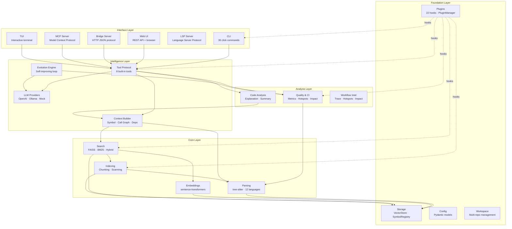
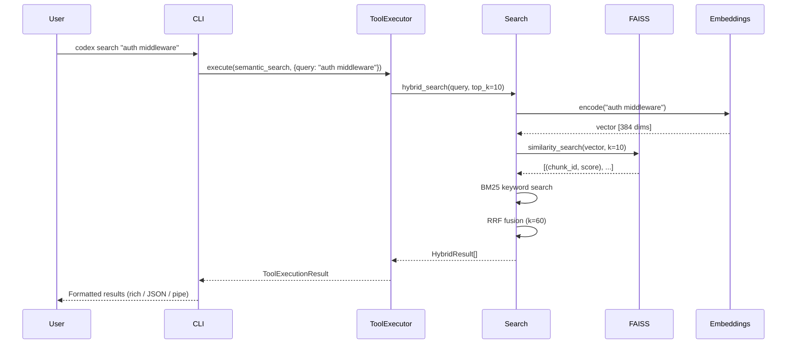
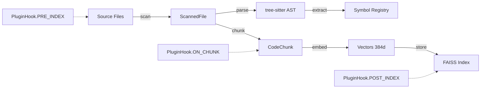

# Architecture

CodexA is organized as a layered system with 26 packages under `semantic_code_intelligence/`.

## High-Level Overview



## Layer Description

### Interface Layer

The entry points for users and AI agents. All interfaces share the same underlying tool protocol.

| Package | Purpose |
|---------|---------|
| `cli` | 36 Click commands with `--json`, `--pipe`, `--verbose` flags |
| `web` | Lightweight HTTP server with REST API and browser UI |
| `bridge` | Stateless JSON/HTTP bridge for IDE extensions |
| `mcp` | Model Context Protocol server (official MCP SDK) |
| `lsp` | Language Server Protocol for editor integration |
| `tui` | Textual-based interactive terminal REPL |

### Intelligence Layer

Orchestrates AI-powered features and tool execution.

| Package | Purpose |
|---------|---------|
| `tools` | `ToolExecutor`, `ToolInvocation`, `ToolRegistry` — 8 built-in tools |
| `llm` | Provider abstraction: OpenAI, Ollama, Mock with caching and streaming |
| `context` | `ContextBuilder`, `ContextWindow`, `CallGraph`, `DependencyMap`, `SessionMemory` |
| `evolution` | `EvolutionEngine`, `BudgetGuard`, `TaskSelector`, `PatchGenerator`, `TestRunner` |

### Analysis Layer

Code quality, metrics, and workflow intelligence.

| Package | Purpose |
|---------|---------|
| `ci` | Quality analysis, metrics snapshots, hotspot detection, impact analysis, quality gates |
| `analysis` | `RepoSummary`, `CodeExplanation`, `LanguageStats` |
| `services` | `IndexingResult`, `SearchResult` — service-layer abstractions |

### Core Layer

Parsing, indexing, embedding, and search infrastructure.

| Package | Purpose |
|---------|---------|
| `parsing` | tree-sitter AST parsing for 12 languages, `Symbol` extraction |
| `indexing` | `CodeChunk`, `ScannedFile`, `SemanticChunk` — file scanning and chunking |
| `embeddings` | sentence-transformers model management (`all-MiniLM-L6-v2`) |
| `search` | FAISS vector search, BM25 keyword search, hybrid RRF fusion |

### Foundation Layer

Storage, configuration, plugins, and workspace management.

| Package | Purpose |
|---------|---------|
| `storage` | `VectorStore`, `SymbolRegistry`, `IndexStats`, `QueryHistory` |
| `config` | Pydantic models: `AppConfig`, `EmbeddingConfig`, `SearchConfig`, `LLMConfig` |
| `plugins` | `PluginManager`, `PluginBase`, 22 `PluginHook` points |
| `workspace` | `Workspace`, `WorkspaceManifest` — multi-repo management |

## Data Flow



## Indexing Pipeline



## Directory Layout

```
semantic_code_intelligence/
├── __init__.py
├── analysis/        # Code explanation & summary
├── bridge/          # HTTP bridge server
├── ci/              # Quality, metrics, hotspots, impact, gates
├── cli/             # 36 Click commands
├── config/          # Pydantic configuration models
├── context/         # Context builder, call graph, deps
├── daemon/          # Background file watcher & indexer
├── docs/            # Documentation generation utilities
├── embeddings/      # Sentence-transformer model management
├── evolution/       # Self-improving development loop
├── indexing/        # Code chunking & file scanning
├── llm/             # LLM providers (OpenAI, Ollama, Mock)
├── lsp/             # Language Server Protocol
├── mcp/             # Model Context Protocol server
├── parsing/         # tree-sitter AST parsing (12 languages)
├── plugins/         # Plugin system (22 hooks)
├── scalability/     # Batch processing, memory-aware embedding
├── search/          # FAISS vector + BM25 + hybrid search
├── services/        # Service-layer result types
├── storage/         # VectorStore, SymbolRegistry, caches
├── tests/           # 2595+ tests
├── tools/           # AI Agent Tool Protocol (8 tools)
├── tui/             # Textual interactive terminal
├── utils/           # Logging utilities
├── web/             # Web UI + REST API
└── workspace/       # Multi-repo workspace management
```
