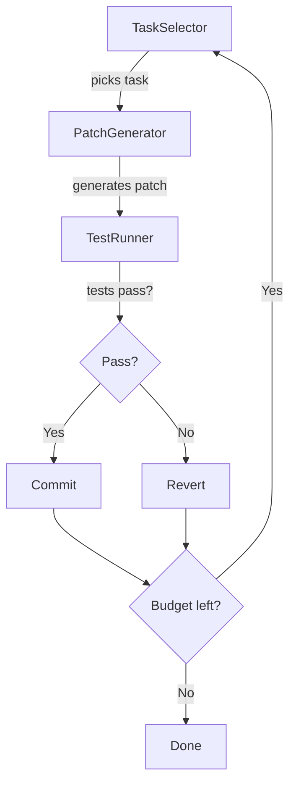

# Evolution Engine

CodexA's **Evolution Engine** is a self-improving development loop that
automatically selects improvement tasks, generates patches via LLM,
validates them with tests, and commits successes.

## Quick Start

```bash
codex evolve
codex evolve --iterations 5 --budget 50000
codex evolve --timeout 300
```

## How It Works



1. **TaskSelector** scans the codebase for improvement opportunities:
   - Fix failing tests
   - Add type hints to untyped functions
   - Improve error handling
   - Reduce code duplication
   - Simplify complex functions

2. **PatchGenerator** uses the configured LLM to generate code changes

3. **TestRunner** runs the test suite to validate the patch

4. **BudgetGuard** tracks token usage, wall-clock time, and iteration count

5. If tests pass → commit; if tests fail → revert and try next task

## Configuration

| Option | Default | Description |
|--------|---------|-------------|
| `--iterations, -n` | 3 | Maximum improvement iterations |
| `--budget, -b` | 20,000 | Maximum total LLM tokens |
| `--timeout, -t` | 600 | Maximum wall-clock seconds |
| `--path, -p` | `.` | Project root path |

## Budget Guard

The Evolution Engine enforces strict budgets to prevent runaway spending:

- **Token budget** — Total tokens across all LLM calls
- **Time budget** — Wall-clock timeout for the entire run
- **Iteration limit** — Maximum number of improvement cycles

If any budget is exhausted, the engine stops gracefully.

## Components

| Class | Description |
|-------|-------------|
| `EvolutionEngine` | Orchestrates the self-improvement loop |
| `BudgetGuard` | Enforces token/time/cost budgets |
| `TaskSelector` | Selects the next improvement task |
| `PatchGenerator` | Generates code patches via LLM |
| `TestRunner` | Runs tests to validate patches |
| `EvolutionResult` | Result of an evolution cycle |
| `EvolutionTask` | A single improvement task |
| `EvolutionBudget` | Budget configuration |

## Safety

- Every change is validated by the test suite before committing
- Failed patches are automatically reverted
- Budget limits prevent runaway LLM usage
- The engine never modifies code without test validation

::: warning
The Evolution Engine requires a configured LLM provider. See
[Configuration](../guide/configuration) for setup.
:::
