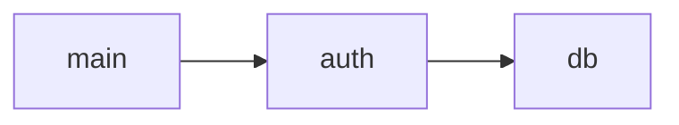

# Web Interface

CodexA ships an optional lightweight web interface that provides a browser-based
search UI and REST API on a single port.

## Quick Start

```bash
codexa web
# Opens at http://127.0.0.1:8080

codexa web --port 9000 --host 0.0.0.0
```

No external frameworks — the server uses Python's built-in `http.server`.

## Web UI

The browser interface provides four pages:

| Path | Page | Description |
|------|------|-------------|
| `/` | Search | Semantic search with live results |
| `/symbols` | Symbol Browser | Browse all extracted symbols |
| `/workspace` | Project Overview | Language stats, file counts |
| `/viz` | Visualization | Interactive Mermaid diagrams |

The UI uses server-rendered HTML with inline CSS (dark theme) and
vanilla JavaScript — no build step required.

## REST API

| Method | Path | Description |
|--------|------|-------------|
| `GET` | `/health` | Server health and project metadata |
| `GET` | `/api/search?q=&top_k=&threshold=` | Semantic code search |
| `GET` | `/api/symbols?file=&kind=` | Symbol table browser |
| `GET` | `/api/deps?file=` | File dependency graph |
| `GET` | `/api/callgraph?symbol=` | Call graph edges |
| `GET` | `/api/summary` | Project summary |
| `POST` | `/api/ask` | Natural language question |
| `POST` | `/api/analyze` | Code validation/explanation |

### POST `/api/ask`

```json
{
  "question": "How does authentication work?",
  "top_k": 5
}
```

### POST `/api/analyze`

```json
{
  "code": "def hello(): ...",
  "mode": "validate"
}
```

## Visualization

Generate Mermaid diagrams from the CLI or API:

```bash
codexa viz callgraph               # Function call flowchart
codexa viz deps --target main.py   # Dependency graph
codexa viz symbols --target auth.py # Class diagram
codexa viz workspace               # Project map
```

### Diagram Types

| Kind | Description |
|------|-------------|
| `callgraph` | Caller → callee flowchart |
| `deps` | File dependency flowchart |
| `symbols` | Class diagram of symbols |
| `workspace` | Hub-and-spoke project map |

Output example:



## Configuration

```bash
codexa web [options]

Options:
  --host, -h TEXT     Host to bind (default: 127.0.0.1)
  --port, -p INTEGER  Port to bind (default: 8080)
  --path DIRECTORY    Project root path
```
